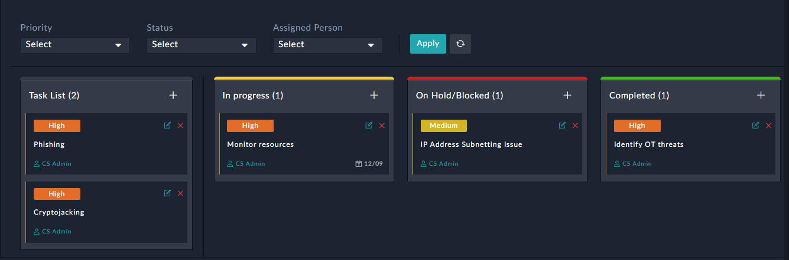
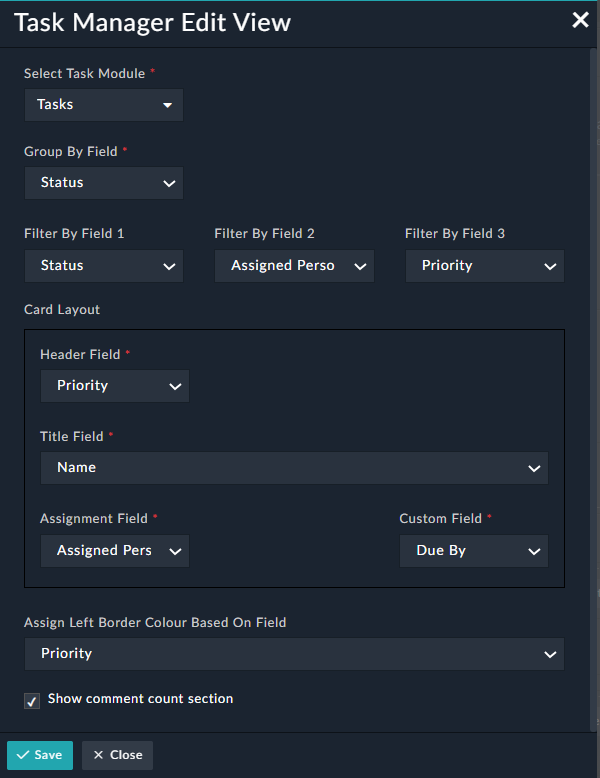

## Task Management

Enables users to manage tasks through its different stages of completion using Kanban visualization.

The different stages of a task are as follows:

*	In Progress
*	On Hold/Blocked
*	Completed

**Certified**: Yes

**Publisher**: Fortinet

**Compatibility**: 7.0.2 or higher

**Applicable**: View Panel

**Task Management Widget**:

 

**Task Manager Edit View**:

 

**Widget Details**:

The following information needs to be filled:

| Fields     | Description          |
| -------- | -------------- |
| Select Task Module | Select the module for which you wish to depict its flow of completion. Most likely, you will be selecting the Tasks module. |
| Group By Field | Select the field based on which you wish to group the tasks. For example, if you select **Status**, the tasks will be grouped as **In Progress**, **On Hold/Blocked**, and **Completed**.  |
| Filter By Field 1 / 2 / 3 | Select the fields based on which you wish to filter the tasks that are to be displayed using Kanban visualization. |
| Card Layout: Header Field | Select the field that should sever as the header text for the task card. |
| Card Layout: Title Field | Select the field that should sever as the title text for the task card. |
| Card Layout: Assignment Field | Select the field that should sever as the assignment text for the task card. |
| Card Layout: Custom Field | Select the date-time field that should be displayed on the task card. For example, select **Due By** to display when the task is due for completion. |
| Assign Left Border Colour  Based On Field | Select the field based on which the task card should be color-coded. |
| Show comment count section   | Checking this box displays the comment count for the task card. |